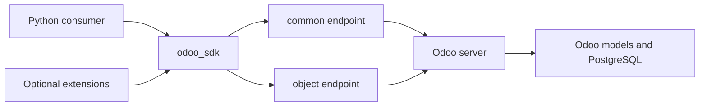
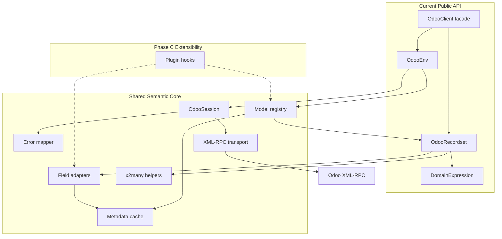
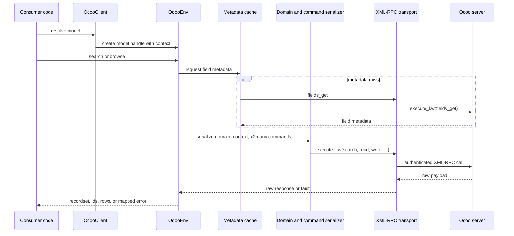
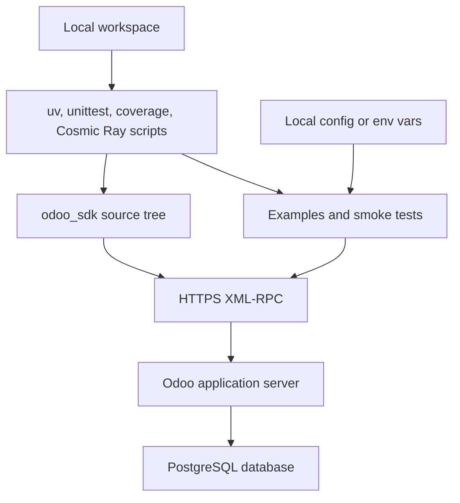
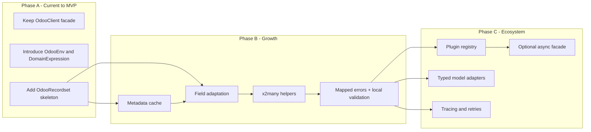
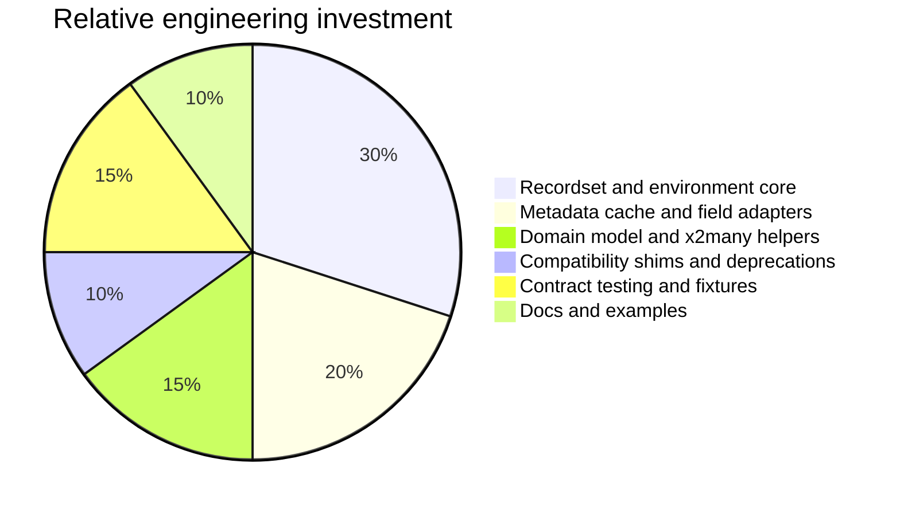

# Odoo SDK - Architecture Plan

## Discovery Summary
> Captured requirements, constraints, and assumptions.

Known requirements
- Build a Python SDK around Odoo 18 external XML-RPC API.
- Move toward an interface that mirrors Odoo ORM semantics, especially model access, recordsets, domains, context, relational traversal, and fluent chaining.
- Keep deliverables under `docs/`.
- Keep tooling local-only for now; no CI pipeline or package publishing workflow is required at this phase.
- Improve extensibility so new abstractions can be added without repeatedly widening `OdooModel` or `OdooQuery`.

Existing system snapshot
- Transport: `OdooRpcExecutor` authenticates through `/xmlrpc/2/common` and calls `execute_kw` on `/xmlrpc/2/object`.
- Entry point: `OdooClient` caches model-bound recordsets and delegates execute calls.
- Model API: `OdooModel` now acts as a legacy adapter over the recordset-first core; explicit `read()` helpers still return row payloads.
- Query API: `OdooQuery` remains a legacy fluent compatibility shim over recordset-owned execution.
- Tooling: local scripts exist for local validation, and mutation testing now defaults to fixed local HTTP Cosmic Ray workers on ports `18101`-`18108` with per-worker copies isolated under `/tmp`.
- Extension sample: `CommandDispatcher` provides consumer-side command wiring but is orthogonal to ORM mirroring.

Assumptions
- This is currently a synchronous Python package, not a web service.
- Runtime infrastructure cost is negligible compared with engineering cost.
- Validation and developer workflows are local-only for now.
- There is no current need for CI, hosted package distribution, or release automation.
- Backward compatibility matters, but the project is still early enough to add compatibility shims and staged deprecations.
- Odoo 18 behavior is the primary reference, with likely need to tolerate minor version differences.

Open discovery questions for the next iteration
- Which Odoo versions must be supported: 16, 17, 18, or only 18?
- Is the target audience internal automation scripts, long-running services, or an external package for third parties?
- Do you want strict synchronous semantics only, or is an async facade expected later?
- How much API stability do you want before 1.0?
- Is typed model support a priority, or is dynamic introspection sufficient?

## Architecture Style
> Recommended style with rationale and trade-offs.

Option 1: Preserve the thin wrapper and keep adding helpers

| Attribute | Notes |
|---|---|
| Best for | Fast short-term delivery of single RPC methods |
| Strengths | Minimal refactor, small mental model, low implementation cost |
| Trade-offs | Public API stays dict and id based, recordset behavior remains bolted on, extensibility continues to depend on widening `OdooModel` and `OdooQuery` |

Option 2: Modular SDK with transport core plus environment plus recordset facade

| Attribute | Notes |
|---|---|
| Best for | Mirroring Odoo ORM semantics over XML-RPC without locking the project into a code generator |
| Strengths | Clear abstraction boundaries, better extension points, supports metadata caching and relational adapters, enables stable public contracts |
| Trade-offs | Requires a medium refactor, needs compatibility shims, raises design discipline requirements |

Option 3: Code-generated model clients from live metadata

| Attribute | Notes |
|---|---|
| Best for | Highly typed internal use cases with a narrow model surface |
| Strengths | Better IDE support, explicit schemas |
| Trade-offs | Poor fit for Odoo's dynamic model landscape, version drift becomes a build problem, custom modules make the generated surface unstable |

Recommendation
- Use Option 2.
- Keep `OdooClient` as the main facade, but re-center the SDK on `OdooEnv`, `OdooRecordset`, and a metadata-aware model registry.
- Retain the current thin wrappers only as transition layers, not as the final core.
- Promote `OdooEnv`, `DomainExpression`, and `OdooRecordset` into the supported package API now that the recordset-first contract is implemented.

Current implementation boundary
- `OdooClient`, `OdooEnv`, `DomainExpression`, and `OdooRecordset` are now the supported public entry surfaces.
- `client["model"]` and `env["model"]` return empty model-bound `OdooRecordset` instances.
- `OdooModel` and `OdooQuery` remain compatibility layers. They delegate toward env-bound and recordset-bound behavior and are no longer the preferred usage story.
- `OdooEnv` owns execution context, metadata caching, and the shared field-value cache used for lazy singleton field access.
- Raw `read()` and `read_adapted()` extraction remain explicit low-level helpers even though the primary ergonomic path is now recordset identity plus dot access.

Why
- The current architecture already has a clean transport seam.
- The main gap is not RPC connectivity; it is the missing unit of abstraction between "model" and "row dictionary".
- In Odoo's ORM, the core concept is the recordset. Without that, ORM parity, relational traversal, field semantics, and extension hooks all stay awkward.

## Technology Stack
> Full stack recommendation with evaluation matrix scores.

Evaluation matrix for the recommended stack

| Criterion | Weight | Score | Notes |
|---|---|---:|---|
| Team Fit | High | 5/5 | Keeps Python and the existing codebase intact |
| Ecosystem Maturity | High | 5/5 | Python stdlib XML-RPC plus Odoo's documented API is stable and well understood |
| Scalability | High | 4/5 | Good enough for SDK use if metadata caching and batching are added |
| Cost of Ownership | Medium | 4/5 | Low runtime cost, moderate refactor cost |
| Hiring Market | Medium | 5/5 | Python is broadly available |
| Performance | Medium | 3/5 | XML-RPC has overhead, so SDK-side caching and bulk methods matter |
| Security Posture | Medium | 4/5 | Strong if API keys, TLS, secret redaction, and permission boundaries are handled correctly |
| Vendor Lock-in Risk | Low-Med | 2/5 | The project is intentionally tied to Odoo's external API |

Layer recommendations

| Layer | Primary | Alternative | Trade-offs |
|---|---|---|---|
| Public API | Recordset-first synchronous Python facade | Query-builder-first facade | Recordsets mirror Odoo better; query builders are simpler but less expressive |
| Transport | Wrapped `xmlrpc.client` session adapter | Custom XML-RPC over `httpx` | Stdlib is simpler; custom HTTP client gives finer timeout and telemetry control |
| Metadata | In-memory `fields_get` cache with explicit invalidation | Optional SQLite metadata cache | Memory cache is enough early; SQLite only matters for heavy reuse or offline tooling |
| Context and identity | `OdooEnv` plus immutable `OdooRecordset` | Context passed ad hoc in each method | First-class env and recordset objects support `with_context` and future auth variants |
| Value adaptation | Dynamic field adapters based on metadata | Raw dict responses everywhere | Adapters add complexity but are mandatory for ORM-like relations |
| Extension model | Recordset-centered semantic seams in Phase B, then narrow plugin contracts plus centralized plugin-aware wiring in Phase C | `CommandDispatcher`-only extensions | Deferring plugin seams until Phase C keeps Phase B focused on shared semantic boundaries while keeping Phase C additive to the recordset-first core |
| Build and test | Keep `unittest`, Hypothesis, coverage, and local scripts such as `uv` tasks and Cosmic Ray helpers | Mock-only tests | Local integration checks against a live Odoo instance still catch version drift without introducing CI yet |
| Observability | Structured logging now, local execution-policy hooks in Phase C, hosted observability deferred | Logging only | Logging is enough now; later hooks keep future instrumentation cheap without widening Phase B or requiring hosted services |

Recommended package layout evolution

```text
src/
    command_registry/
        command_registry.py
    odoo_service/
        errors.py
        odoo_client.py
        odoo_env.py
        odoo_executor.py
        odoo_rpc_executor.py
        domain_expression.py
        odoo_recordset.py
        field_adapters.py
        metadata_cache.py
        x2many_commands.py
        plugins/
            contracts.py
            registry.py
        adapters/
            registry.py
            stable_models.py
        execution_policy.py
```

Phase B is primarily concerned with the shared semantic boundaries already living under `odoo_sdk.odoo_service`. Phase C should extend that existing package with narrow internal plugin, adapter, and policy modules rather than forcing a package rename or a second public architecture.

## System Architecture
> All Mermaid diagrams with detailed explanations.
> Link to HTML viewer: [View Interactive Diagrams](./odoo-sdk-architecture-diagrams.html)

Current implementation review

| Current component | Current role | Extensibility assessment |
|---|---|---|
| `OdooClient` | Entry point and model-bound recordset cache | Strong facade now that it anchors the root env and public recordset lookup |
| `OdooRpcExecutor` | Authentication and `execute_kw` transport | Strong transport seam worth preserving |
| `OdooModel` | Legacy compatibility adapter over recordset behavior | Useful only as a migration layer; no longer the public center |
| `OdooQuery` | Legacy fluent builder shim | Useful for compatibility, but no longer returned by the primary lookup path |
| `CommandDispatcher` | Consumer-side command wiring | Useful integration helper, but not core to ORM mirroring |

Root architectural findings
- The SDK now models env, domain, and recordset explicitly at the public boundary.
- `browse` now returns model-bound `OdooRecordset` identity instead of row payloads.
- `DomainExpression` centralizes boolean-prefix domain support and serialization.
- Context is first-class in `OdooEnv`, and recordsets carry that env boundary forward.
- Field metadata and lazily fetched singleton field values are now cached centrally through the env boundary.
- Raw `read()` extraction remains explicit, while x2many writes and singleton dot access route through recordset-owned behavior.
- `CommandDispatcher` remains exported, but it is still orthogonal to the ORM-like core.

Public API trajectory

| Public surface | Current implemented behavior | Notes |
|---|---|---|
| `client["res.partner"]` | Returns an empty model-bound `OdooRecordset` | Primary supported entry path |
| `search(domain, limit=..., offset=..., order=...)` | Returns `OdooRecordset` | Native Odoo-style search shape on recordsets and `OdooModel` |
| `browse(ids)` | Returns `OdooRecordset` with stable identity | No row-returning browse path remains on the primary API |
| `read()` and `read_adapted()` | Return row payloads explicitly | Low-level extraction helpers, not the primary ergonomic API |
| `with_context(...)` | Returns a derived env or recordset | Context ownership lives in `OdooEnv` |
| Relational field access | `read()` stays raw, `read_adapted()` adapts payloads, singleton dot access returns adapted values or related recordsets | Current code already supports many2one traversal and cached singleton scalar access |

Compatibility overlay
- `OdooModel` and `OdooQuery` remain importable for compatibility, but they no longer define the primary public contract.
- `OdooModel.search()` now returns `OdooRecordset` directly.
- `OdooQuery` remains available only for callers that intentionally preserve legacy builder-style chaining.
- Raw extraction still coexists with recordset identity and dot access; the compatibility surface is additive rather than a second architectural center.

### System Context Diagram



This context is intentionally small. The SDK sits between Python consumer code and Odoo's XML-RPC endpoints. Optional extensions should attach to the SDK layer, not directly to transport objects, so the public abstraction stays stable.

### Component / Container Diagram



The major improvement is the separation of concerns:
- The current public API is recordset-first: `OdooClient`, `OdooEnv`, `DomainExpression`, and `OdooRecordset` are all supported exports.
- A shared execution boundary, potentially realized as `OdooSession`, owns authentication, transport policy, and mapped-error behavior in the longer-term architecture.
- `OdooEnv` owns context and session-bound model resolution.
- `OdooRecordset` owns ids, model identity, and fluent ORM-like behavior.
- `MetadataCache`, `FieldAdapters`, and x2many helpers are the Phase B semantic additions routed through the shared core.
- Plugin hooks remain a Phase C extensibility seam rather than a Phase B deliverable.

### Data Flow Diagram



This keeps network I/O explicit and gives the SDK a consistent place to plug in retries, tracing, redaction, and field adaptation.

### Local Tooling Diagram



At this phase, the relevant runtime architecture is local developer tooling plus direct access to Odoo. Packaging and hosted automation can wait until the public API and extension model settle down.

### Scalability Evolution Diagram



The phases are evolutionary rather than revolutionary. The immediate goal is to add missing abstractions without breaking the current public surface.

### Cost Breakdown Diagram



The project's main cost is engineering time, not runtime infrastructure. Most value comes from getting the core abstractions right.

## Scalability Roadmap
> Phased plan: MVP -> Growth -> Scale with diagrams for each.

### Phase A - MVP

Implementation checklist
- [Phase A Implementation Checklist](./implementation/phase-a-implementation-checklist.md)

Scope
- Preserve `OdooClient` as the top-level facade.
- Introduce `OdooEnv` as the root for context and session.
- Introduce `DomainExpression` to replace the current list-of-tuples domain alias at the public boundary.
- Introduce `OdooRecordset` with ids, model name, env, and basic `read`, `write`, `unlink`, `exists`, `browse`, `search`, and `with_context` behavior.
- Keep `OdooQuery` as a compatibility shim.

What changes from the current implementation
- Public results gain stable identity.
- Context stops being query-only state and becomes env or recordset state.
- Domain serialization becomes centralized rather than ad hoc.

Why it is needed
- Without this phase, every future ORM-like feature remains an exception path.

Cost implications
- Medium refactor cost.
- Low runtime cost increase, offset later by fewer repeated calls.

Migration path
- Re-implement `OdooModel.search` and `browse` on top of `OdooRecordset`.
- Keep current methods returning `list[dict]` as extraction helpers during transition.

### Phase B - Growth

Implementation checklist
- [Phase B Implementation Checklist](./implementation/phase-b-implementation-checklist.md)

Scope
- Add `fields_get` caching keyed by model, requested field set,
  requested attribute set, and request context when that context changes the
  raw metadata payload.
- Add field adapters for many2one, one2many, many2many, date, datetime, and binary normalization.
- Add x2many command helpers mirroring Odoo's command tuple protocol and normalize them through the shared recordset write path.
- Add local integration checks against at least one live Odoo instance.
- Add explicit error classes for auth, access, validation, missing records, and transport faults.

What changes from Phase A
- The SDK starts interpreting Odoo semantics instead of just transporting payloads.
- Write-side x2many operations gain SDK helper objects that normalize to canonical Odoo command tuples before XML-RPC execution.
- Local validation becomes more RPC-aware and less dependent on mocks alone.

Why it is needed
- This is the phase that turns recordsets into useful ORM mirrors rather than ids with convenience methods.

Cost implications
- Medium engineering cost.
- Runtime cost decreases because metadata and repeated field lookups can be cached.

Migration path
- Start with read-only adapters and metadata cache.
- Route write-side x2many helpers through recordset-first internals while preserving raw tuple compatibility for existing callers.
- Introduce error mapping without changing the transport wire protocol.

### Phase C - Scale

Implementation baseline
- [Phase C Extensibility Contract](./implementation/phase-c/phase-c-extensibility-contract.md)

Implementation checklist
- [Phase C Implementation Checklist](./implementation/phase-c-implementation-checklist.md)

Scope
- Add narrow plugin contracts and centralized plugin-aware wiring for model-specific behavior and targeted extensions.
- Add optional typed adapters for selected stable internal models without replacing the default dynamic path.
- Add tracing, retry, timeout, and local telemetry through a session or executor-adjacent execution-policy boundary.
- Evaluate a separate async facade and record an explicit outcome rather than mutating the sync API in place.

Deferred in Phase C
- No forced async migration or mixed sync/async facade.
- No broad code generation across the Odoo model surface.
- No hosted observability rollout or remote plugin infrastructure.
- No CI, package publishing, or release automation work.
- No redesign of the recordset-first core.

Guardrails
- Keep the synchronous facade as the default supported execution path throughout Phase C.
- Preserve `OdooClient`, `OdooEnv`, `DomainExpression`, `OdooRecordset`, `OdooModel`, `OdooQuery`, `OdooExecutor`, and `CommandDispatcher` as usable public surfaces.
- Keep validation local-only and defer hosted observability, CI exit gates, packaging automation, and release automation.

What changes from Phase B
- Extensibility becomes intentional through contract-guarded seams rather than incidental internal override points.
- Operational concerns become first-class through one defined policy boundary.

Why it is needed
- Once multiple consumers depend on the SDK, stability, observability, and targeted extension points matter more than raw feature count.

Cost implications
- Medium to high engineering cost.
- Still low runtime infrastructure cost.

Migration path
- Keep plugin APIs additive.
- Keep async separate from the sync surface to avoid semantic drift.

## Existing System Review
> Audit findings, bottlenecks, modernization backlog.

### Architecture audit

Strengths
- Clear transport seam via `OdooExecutor` and `OdooRpcExecutor`.
- `OdooClient` already serves as a natural facade.
- `OdooQuery` is immutable, which is a good foundation for predictable chaining.
- Tests focus on behavioral contracts rather than implementation details in several places.

Debt and anti-patterns
- Missing recordset abstraction is the largest design gap.
- Domain typing cannot express full Odoo domain algebra.
- `OdooModel` combines model handle and convenience service responsibilities.
- Raw dict and list payloads leak wire format into all consumers.
- `CommandDispatcher` is exposed in the core package even though it is not required for ORM parity.
- No metadata registry means field semantics cannot be extended centrally.
- No consumer-visible plugin or protocol layer exists for model adapters or value transformations.

### Scalability assessment

Current bottlenecks
- Repeated XML-RPC round trips will grow quickly once field adaptation or relational traversal is added.
- There is no metadata cache, so `fields_get` based behavior would become chatty if added naively.
- There is no prefetch or batch abstraction beyond manual `search_read` usage.
- The SDK has no stable local integration check set against live Odoo behavior, so version drift is a latent risk.

Components that will not survive 10x growth cleanly
- The current `Domain` alias.
- `OdooModel` as the main expansion point.
- Raw relational values without adapters.
- Mock-only testing for Odoo server behaviors.

Quick wins
- Add a first-class domain serializer.
- Add `OdooEnv` and `OdooRecordset` without removing `OdooClient`.
- Introduce explicit error classes.
- Move `CommandDispatcher` toward integrations or examples.

### Cost issues
- Runtime inefficiency would come mostly from repeated metadata and relation lookups, not from CPU.
- Engineering cost is inflated by the current abstraction shape because each new feature requires widening multiple public objects.
- Consumer-side code will duplicate relation handling if the SDK keeps returning raw values.

### Modernization recommendations

Keep
- `OdooClient` as the public entry point.
- `OdooRpcExecutor` as the lowest-level sync transport implementation.
- The existing tests as a base contract suite.

Refactor
- `OdooModel` into a thin model handle or compatibility layer.
- `OdooQuery` into an internal search specification or transitional adapter.
- Domain and context handling into dedicated abstractions.

Replace or reposition
- Replace raw record dictionaries as the default high-level abstraction with recordsets.
- Reposition `CommandDispatcher` as optional integration support rather than core ORM surface.

## Best Practices & Patterns
> Tailored recommendations for this specific project.

Focused pattern guidance
- See [Odoo SDK - Applicable Design Patterns](./odoo-sdk-design-patterns.md) for the direct pattern mapping.
- The patterns that fit the current codebase without interface churn are: Command, Facade, Strategy, Proxy, a lightweight Builder, and a lightweight Factory Method.
- The next internal pattern worth adding is Adapter for field and value translation.
- Decorator is appropriate only for repeated cross-cutting concerns around execution, such as logging, retry, timing, or redaction.

Pattern-driven design rules
- Keep `OdooClient` as a facade, not as a dumping ground for business rules or field adaptation logic.
- Keep `OdooExecutor` as the strategy seam for transport behavior.
- Keep `OdooModel` proxy-like and transport-oriented rather than turning it into an application service layer.
- Keep `OdooQuery` immutable and builder-like instead of growing `OdooModel` with many narrow search helpers.
- Add adapters before adding more convenience methods for raw XML-RPC payload shapes.
- Keep command creation and model proxy creation centralized through the existing factory seams.

Architecture rules that complement those patterns
- Recordset-first public API: the fundamental unit should always know model, ids, and env.
- Immutable context propagation: `with_context` should create a new env or recordset, never mutate in place.
- Centralized domain algebra: represent boolean operators, nesting, and serialization in one module.
- Metadata-driven adaptation: relations, dates, datetimes, and x2many commands should use field metadata rather than hand-coded special cases.
- Compatibility shims: keep legacy `OdooModel` and `OdooQuery` methods as wrappers while the new core stabilizes.
- Local integration testing against live Odoo: use at least one reference instance to validate `fields_get`, search domains, auth, and error behavior.
- Tooling should stay scriptable from the local workspace first; CI can be added only after the workflow stops changing weekly.

Patterns to avoid
- Distributed method bag: adding every Odoo method directly onto `OdooModel`.
- Shared raw payload semantics: making every consumer understand many2one tuples and x2many command triples.
- Hidden transport leakage: letting retries, auth, or XML-RPC faults surface differently across layers.
- Premature code generation: generating model classes before the dynamic extension model is stable.
- Pattern cargo-culting: introducing Mediator, Abstract Factory, Singleton, Observer, or Visitor without a concrete pressure point in the current SDK.
- Attribute magic before instrumentation: adding implicit network I/O on field access before you have tracing and cache visibility.

Project-specific notes on Odoo semantics
- Mirror Odoo where it improves ergonomics, but document unsupported semantics clearly.
- Not every server-side ORM behavior translates cleanly over RPC, especially lazy field access and server-managed cache behavior.
- The SDK should target practical ORM parity, not a perfect in-process ORM clone.

## Security Architecture
> Threat model, auth strategy, data protection.

Authentication and secret management
- Support API keys and passwords, but prefer API keys operationally.
- Keep secrets in environment variables or external config files, not in source-controlled examples.
- Redact credentials from logs and exceptions.

Transport security
- Require HTTPS endpoints in normal usage.
- Centralize timeout and retry policy in the session layer.
- Distinguish auth failures from transport failures from server faults.

Authorization semantics
- Preserve Odoo's permission model; do not mask access errors as generic runtime errors.
- Make context changes explicit so consumers can reason about company, language, and access boundaries.

Data handling
- Cache field metadata freely, but treat record payload caching conservatively until invalidation semantics are clear.
- Avoid storing sensitive record data beyond process memory unless there is a clear use case and invalidation strategy.

## Risks & Mitigations
> Top risks with mitigation strategies and owners.

| Risk | Impact | Mitigation | Suggested owner |
|---|---|---|---|
| ORM parity ambition exceeds what XML-RPC can express cleanly | High | Define a supported subset explicitly and keep low-level escape hatches | Maintainer |
| Odoo version drift breaks metadata or response assumptions | High | Add local integration checks against targeted Odoo versions | Maintainer |
| Public API churn frustrates early adopters | Medium | Ship compatibility shims and deprecation notes | Maintainer |
| Metadata and relation adaptation introduce performance regressions | Medium | Add cache metrics, batch tests, and `read_group` or `search_read` benchmarks | Maintainer |
| Plugin system becomes too loose or too magical | Medium | Use typed protocols and narrow hook points | Maintainer |

## Architecture Decision Records
> Links to ADR files for key decisions.

- [ADR-001 - Adopt a recordset-first public API](./architecture/ADR-001-recordset-first-public-api.md)
- [ADR-002 - Introduce a session and transport policy boundary](./architecture/ADR-002-session-and-transport-boundary.md)
- [ADR-003 - Add metadata caching and internal field adaptation](./architecture/ADR-003-metadata-cache-and-plugin-adapters.md)

## Next Steps
> Prioritized action items for the implementation team.

1. Confirm discovery answers around supported Odoo versions, target consumers, and compatibility expectations.
2. Approve the recordset-first direction in ADR-001.
3. Implement the smallest vertical slice: `OdooEnv`, `DomainExpression`, and `OdooRecordset` while preserving `OdooClient`.
4. Re-route `OdooModel.search` and `browse` through the new recordset abstraction.
5. Add a local integration check path against a live Odoo instance before adding rich field adaptation.
6. Keep local tooling simple: `uv`, `unittest`, coverage, and the existing scripts are enough until the architecture stabilizes.
7. Move `CommandDispatcher` toward an integrations namespace or examples once the core ORM surface is stable.
