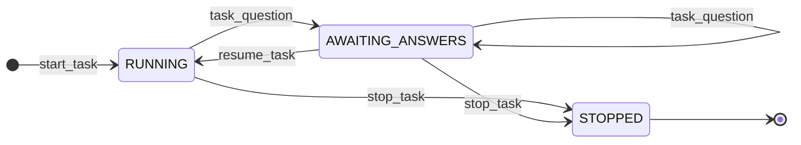

# Task Tracker FSM

State machine governing task time-tracking sessions. Each `project.task` record in Odoo
gets its own independent FSM instance, keyed by task ID in the local SQLite database.
Multiple tasks can be active simultaneously (parallel worktree support).

## State Diagram

## States

| State              | Meaning                                                              |
|--------------------|----------------------------------------------------------------------|
| `RUNNING`          | Actively working — timer accumulating                               |
| `AWAITING_ANSWERS` | Questions posted to chatter; work blocked pending stakeholder input  |
| `STOPPED`          | Session ended; time logged to Odoo timesheet                         |

Active states are `RUNNING` and `AWAITING_ANSWERS`. A task absent from the DB has no session.

## Transition Table

| From               | Event           | To                 | Guard                                      |
|--------------------|-----------------|--------------------|--------------------------------------------|
| (absent)           | `start_task`    | `RUNNING`          | No active session for this task_id         |
| `RUNNING`          | `task_question` | `AWAITING_ANSWERS` | Session exists in RUNNING state            |
| `AWAITING_ANSWERS` | `task_question` | `AWAITING_ANSWERS` | Self-loop: additional questions allowed    |
| `AWAITING_ANSWERS` | `resume_task`   | `RUNNING`          | Session exists in AWAITING_ANSWERS state   |
| `RUNNING`          | `stop_task`     | `STOPPED`          | Session exists in RUNNING state            |
| `AWAITING_ANSWERS` | `stop_task`     | `STOPPED`          | Answers indicate no changes needed         |

## Guard Conditions

Guards are enforced in `task_tracker/state.py` and raise typed exceptions:

- `TaskAlreadyRunningError` — `start_task` called when an active session exists
- `TaskNotRunningError` — operation requires an active session but none found
- `InvalidStateTransitionError` — transition not permitted from current state

## Notes

- The state is persisted in SQLite at `<project_dir>/tasks.db` (see `state.py`).
- Project dir is derived from `sha256(git_remote_origin_url)[:16]` under the root.
- Stopping from `AWAITING_ANSWERS` is valid — stakeholder answers may conclude no code changes are needed.
- The timer always uses the `started_at` timestamp in SQLite; elapsed hours are computed on-demand so they remain accurate even after long pauses.
