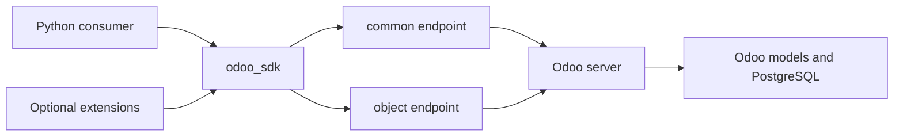
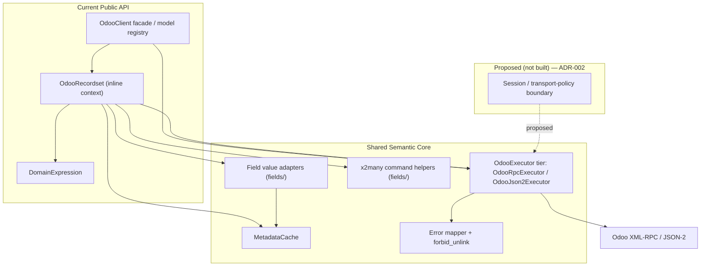
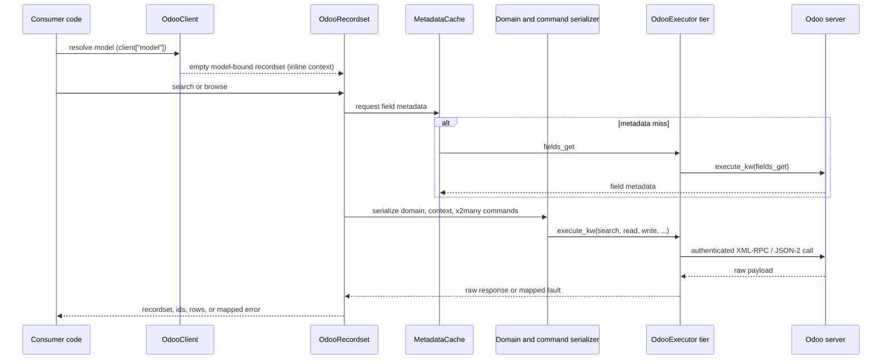
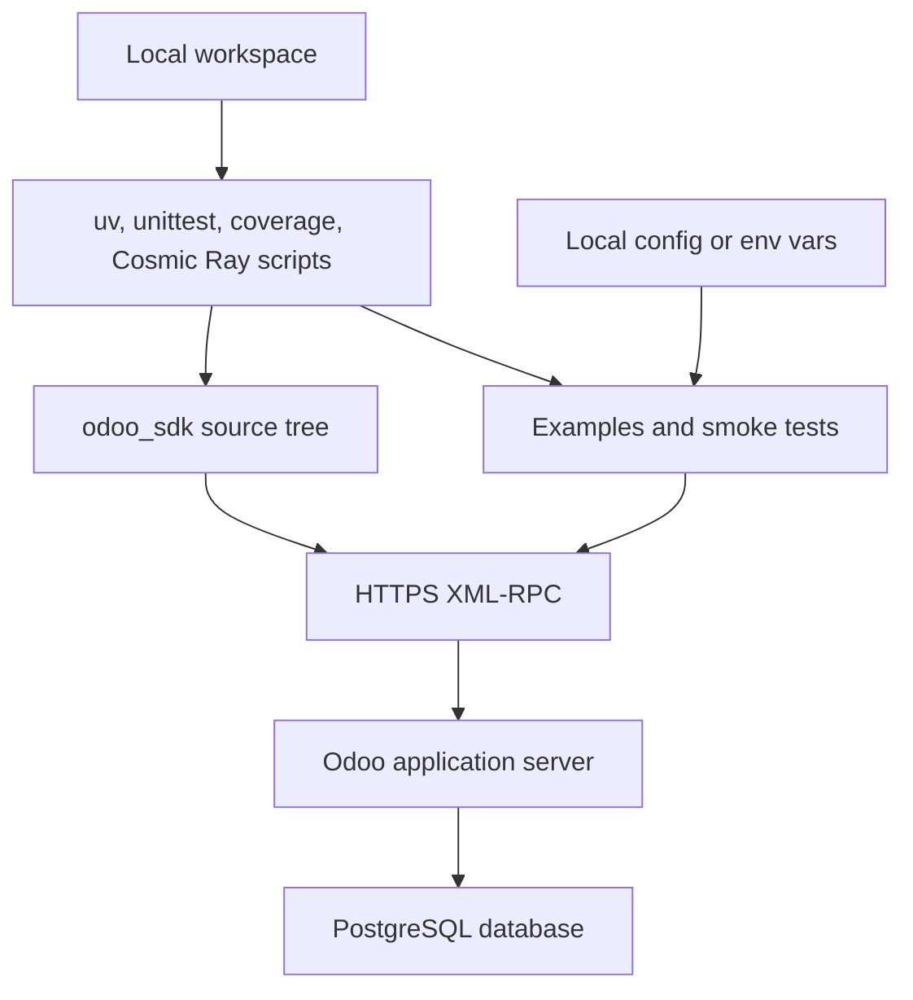
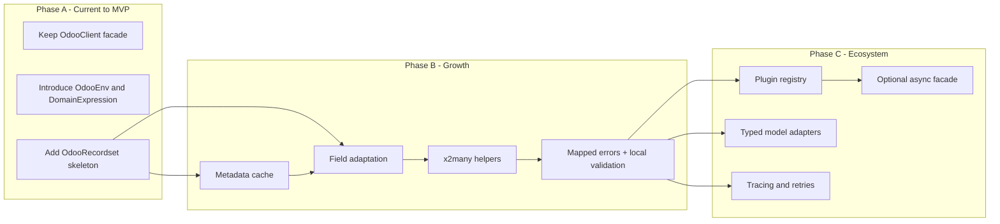
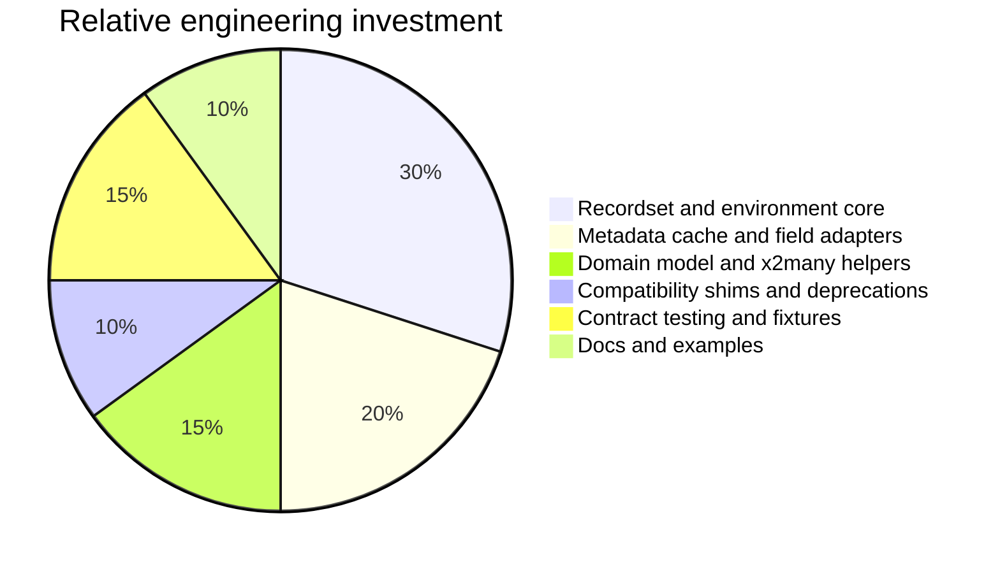

# Odoo SDK - Architecture Plan

> **Reconciliation note (2026-07).** Sections that describe the *current
> implemented* state — the recommendation boundary, package layout, current
> implementation review, public API trajectory, and the system diagrams — have
> been reconciled to the shipped `odoo_sdk` package. The shipped high-level
> public surface is `OdooClient`, `OdooRecordset`, and `DomainExpression`
> (plus `Domain`, `Record`, `Command`/`Registry`, and the `OdooExecutor` /
> `OdooRpcExecutor` / `OdooJson2Executor` transport tier). Planning-era names
> that were **never shipped under those names** — `OdooEnv` (the class),
> `OdooModel`, `OdooQuery`, `OdooSession`, and the `odoo_service` /
> `command_registry`-at-`src`-top-level package tree — have been removed from
> the current-state sections or explicitly flagged as unbuilt. Earlier narrative
> that discusses the *pre-refactor starting point* or *rejected options*
> intentionally still names the historical thin wrappers (`OdooModel`,
> `OdooQuery`) and the never-shipped `OdooEnv` object: in the phased roadmap
> (Phases A–D), the Existing System Review, and the rejected options, those
> names describe the *plan* and its *starting point*, not the shipped design —
> where context and the full ORM-like surface live on `OdooRecordset` and the
> client is itself the model registry. A dedicated session / transport-policy
> object remains
> *proposed only* — see [ADR-002](./architecture/ADR-002-session-and-transport-boundary.md)
> (Proposed); **no session type exists as of 2026-07** (only a passing
> "session bootstrap" mention in a transport error docstring). The implemented
> MCP contract is recorded in
> [ADR-004](./architecture/ADR-004-mcp-wraps-the-command-registry.md).

## Discovery Summary
> Captured requirements, constraints, and assumptions.

Known requirements
- Build a Python SDK around Odoo 18 external XML-RPC API.
- Move toward an interface that mirrors Odoo ORM semantics, especially model access, recordsets, domains, context, relational traversal, and fluent chaining.
- Keep deliverables under `docs/`.
- Keep tooling local-only for now; no CI pipeline or package publishing workflow is required at this phase.
- Improve extensibility so new abstractions can be added without repeatedly widening `OdooModel` or `OdooQuery`.

Existing system snapshot (as shipped)
- Transport: an `OdooExecutor` base with two concrete executors — `OdooRpcExecutor` (XML-RPC over `/xmlrpc/2/common` + `execute_kw` on `/xmlrpc/2/object`) and `OdooJson2Executor` (JSON-2) — live under `odoo_sdk/transport`, alongside the error taxonomy and the cross-cutting `forbid_unlink` guard.
- Entry point: `OdooClient` (itself an `OdooExecutor`) acts as the model registry facade — `client["model"]` returns a cached, empty model-bound `OdooRecordset`.
- Core abstraction: `OdooRecordset` carries ids, model identity, executor, and context inline, and owns the ORM-like surface (`search`, `browse`, `read`/`read_adapted`, `create`, `write`, `name_search`, `_read_group`, `filtered`/`mapped`/`sorted`/`grouped`, set operators, `with_context`/`with_company`, `exists`, `action_archive`, …). There is no separate `OdooModel` / `OdooQuery` type; `unlink` is intentionally forbidden SDK-wide by `forbid_unlink`.
- Domain: `DomainExpression` (with `Condition` / `BooleanExpression`) under `odoo_sdk/query` centralizes domain algebra and serialization.
- Metadata: `MetadataCache` / `MetadataRequestKey` under `odoo_sdk/env` cache `fields_get` payloads; field value adaptation and x2many command helpers live under `odoo_sdk/fields`.
- Extension sample: the command `Registry` (`odoo_sdk/commands`) provides consumer-side command wiring and is the surface the MCP server wraps (see [ADR-004](./architecture/ADR-004-mcp-wraps-the-command-registry.md)); it is orthogonal to ORM mirroring.
- Tooling: local scripts exist for local validation, and mutation testing defaults to fixed local HTTP Cosmic Ray workers on ports `18101`-`18108` with per-worker copies isolated under `/tmp`.

Assumptions
- This is currently a synchronous Python package, not a web service.
- Runtime infrastructure cost is negligible compared with engineering cost.
- Validation and developer workflows are local-only for now.
- There is no current need for CI, hosted package distribution, or release automation.
- Backward compatibility matters, but the project is still early enough to add compatibility shims and staged deprecations.
- Odoo 18 behavior is the primary reference, with likely need to tolerate minor version differences.

Open discovery questions for the next iteration
- Which Odoo versions must be supported: 16, 17, 18, or only 18?
- Is the target audience internal automation scripts, long-running services, or an external package for third parties?
- Do you want strict synchronous semantics only, or is an async facade expected later?
- How much API stability do you want before 1.0?
- Is typed model support a priority, or is dynamic introspection sufficient?

## Architecture Style
> Recommended style with rationale and trade-offs.

Option 1: Preserve the thin wrapper and keep adding helpers

| Attribute | Notes |
|---|---|
| Best for | Fast short-term delivery of single RPC methods |
| Strengths | Minimal refactor, small mental model, low implementation cost |
| Trade-offs | Public API stays dict and id based, recordset behavior remains bolted on, extensibility continues to depend on widening `OdooModel` and `OdooQuery` |

Option 2: Modular SDK with transport core plus environment plus recordset facade

| Attribute | Notes |
|---|---|
| Best for | Mirroring Odoo ORM semantics over XML-RPC without locking the project into a code generator |
| Strengths | Clear abstraction boundaries, better extension points, supports metadata caching and relational adapters, enables stable public contracts |
| Trade-offs | Requires a medium refactor, needs compatibility shims, raises design discipline requirements |

Option 3: Code-generated model clients from live metadata

| Attribute | Notes |
|---|---|
| Best for | Highly typed internal use cases with a narrow model surface |
| Strengths | Better IDE support, explicit schemas |
| Trade-offs | Poor fit for Odoo's dynamic model landscape, version drift becomes a build problem, custom modules make the generated surface unstable |

Recommendation
- Use Option 2 (this was the direction taken and shipped).
- Keep `OdooClient` as the main facade and metadata-aware model registry, and center the SDK on `OdooRecordset`.
- The historical thin wrappers (`OdooModel`, `OdooQuery`) were **not** retained: the recordset-first core replaced them outright rather than carrying them as compatibility layers.
- `DomainExpression` and `OdooRecordset` are promoted into the supported package API; the recordset-first contract is implemented.

Current implementation boundary (as shipped)
- `OdooClient`, `DomainExpression`, and `OdooRecordset` are the supported public entry surfaces. There is no `OdooEnv`, `OdooModel`, or `OdooQuery` class — those planning-era names were never shipped.
- `client["model"]` returns an empty model-bound `OdooRecordset` instance.
- Execution context is carried **inline on `OdooRecordset`** (there is no separate environment object); `with_context` / `with_company` return a derived recordset rather than mutating in place.
- Metadata caching is owned by `MetadataCache` (`odoo_sdk/env`), shared across recordsets that descend from the same client root; lazily fetched singleton field values are cached on the recordset.
- Raw `read()` and `read_adapted()` extraction remain explicit low-level helpers even though the primary ergonomic path is recordset identity plus dot access.

Why
- The current architecture already has a clean transport seam.
- The main gap is not RPC connectivity; it is the missing unit of abstraction between "model" and "row dictionary".
- In Odoo's ORM, the core concept is the recordset. Without that, ORM parity, relational traversal, field semantics, and extension hooks all stay awkward.

## Technology Stack
> Full stack recommendation with evaluation matrix scores.

Evaluation matrix for the recommended stack

| Criterion | Weight | Score | Notes |
|---|---|---:|---|
| Team Fit | High | 5/5 | Keeps Python and the existing codebase intact |
| Ecosystem Maturity | High | 5/5 | Python stdlib XML-RPC plus Odoo's documented API is stable and well understood |
| Scalability | High | 4/5 | Good enough for SDK use if metadata caching and batching are added |
| Cost of Ownership | Medium | 4/5 | Low runtime cost, moderate refactor cost |
| Hiring Market | Medium | 5/5 | Python is broadly available |
| Performance | Medium | 3/5 | XML-RPC has overhead, so SDK-side caching and bulk methods matter |
| Security Posture | Medium | 4/5 | Strong if API keys, TLS, secret redaction, and permission boundaries are handled correctly |
| Vendor Lock-in Risk | Low-Med | 2/5 | The project is intentionally tied to Odoo's external API |

Layer recommendations

| Layer | Primary | Alternative | Trade-offs |
|---|---|---|---|
| Public API | Recordset-first synchronous Python facade | Query-builder-first facade | Recordsets mirror Odoo better; query builders are simpler but less expressive |
| Transport | Wrapped `xmlrpc.client` session adapter | Custom XML-RPC over `httpx` | Stdlib is simpler; custom HTTP client gives finer timeout and telemetry control |
| Metadata | In-memory `fields_get` cache with explicit invalidation | Optional SQLite metadata cache | Memory cache is enough early; SQLite only matters for heavy reuse or offline tooling |
| Context and identity | Context carried inline on immutable `OdooRecordset` | Context passed ad hoc in each method | A single identity-bearing recordset supports `with_context` / `with_company`; a separate environment object (`OdooEnv`) was considered but not shipped |
| Value adaptation | Dynamic field adapters based on metadata | Raw dict responses everywhere | Adapters add complexity but are mandatory for ORM-like relations |
| Extension model | Recordset-centered semantic seams in Phase B, then narrow plugin contracts plus centralized plugin-aware wiring in Phase C | `CommandDispatcher`-only extensions | Deferring plugin seams until Phase C keeps Phase B focused on shared semantic boundaries while keeping Phase C additive to the recordset-first core |
| Build and test | Keep `unittest`, Hypothesis, coverage, and local scripts such as `uv` tasks and Cosmic Ray helpers | Mock-only tests | Local integration checks against a live Odoo instance still catch version drift without introducing CI yet |
| Observability | Structured logging now, local execution-policy hooks in Phase C, hosted observability deferred | Logging only | Logging is enough now; later hooks keep future instrumentation cheap without widening Phase B or requiring hosted services |

Shipped package layout

The early plan sketched an `odoo_service/` tree with a top-level `command_registry/`
package. **That layout was not shipped.** The code lives under a single
`odoo_sdk` package, with each concern in its own subpackage:

```text
src/odoo_sdk/
    __init__.py           # public exports: OdooClient, OdooRecordset,
                          #   DomainExpression, Domain, Record, Command, Registry, …
    transport/            # OdooExecutor base, OdooRpcExecutor (XML-RPC),
                          #   OdooJson2Executor (JSON-2), errors + forbid_unlink,
                          #   fault/HTTP error mapping
    client/               # OdooClient facade / model registry
    records/              # OdooRecordset (the ORM-like core) + Record
    query/                # DomainExpression, Condition, BooleanExpression
    env/                  # MetadataCache, MetadataRequestKey
    fields/               # field value adaptation + x2many command helpers
    adapters/             # external-sync and state-persistence adapters
    commands/             # Command, Registry, builtin commands
    state/                # local task-tracker state (LocalStateClient, models)
    sessionization/       # session derivation from events
    mcp/                  # embedded MCP server, tools, prompts (see ADR-004)
    cli/  tui/            # command-line and terminal UIs
    utilities/            # env/timesheet/prune/reap helpers
```

Semantic growth (metadata cache, field adaptation, x2many helpers) and
extensibility work land in these existing subpackages rather than a separate
`odoo_service` package or a package rename.

## System Architecture
> All Mermaid diagrams with detailed explanations.
> Link to HTML viewer: <a href="../odoo-sdk-architecture-diagrams.html">View Interactive Diagrams</a>

Current implementation review

| Current component | Current role | Extensibility assessment |
|---|---|---|
| `OdooClient` | Entry point, model registry facade, and model-bound recordset cache | Strong facade; it is itself an `OdooExecutor` and anchors public recordset lookup |
| `OdooExecutor` / `OdooRpcExecutor` / `OdooJson2Executor` | Transport base plus XML-RPC and JSON-2 executors; authentication and `execute_kw` | Strong transport seam worth preserving |
| `OdooRecordset` | The recordset-first ORM-like core: ids, model identity, inline context, reads/writes, x2many, set/functional operations | The public center of the SDK |
| `DomainExpression` | Domain algebra and serialization | Centralized domain builder |
| `Registry` (command registry) | Consumer-side command wiring; wrapped by the MCP server | Useful integration helper and the MCP surface, but not core to ORM mirroring |

Root architectural findings
- The SDK models domain and recordset explicitly at the public boundary; context is carried inline on the recordset (there is no `OdooEnv` object).
- `browse` returns model-bound `OdooRecordset` identity instead of row payloads.
- `DomainExpression` centralizes boolean-prefix domain support and serialization.
- Field metadata is cached by `MetadataCache`; lazily fetched singleton field values are cached on the recordset.
- Raw `read()` extraction remains explicit, while x2many writes and singleton dot access route through recordset-owned behavior.
- The command `Registry` remains exported and is the surface the embedded MCP server wraps, but it is still orthogonal to the ORM-like core.

Public API trajectory

| Public surface | Current implemented behavior | Notes |
|---|---|---|
| `client["res.partner"]` | Returns an empty model-bound `OdooRecordset` | Primary supported entry path |
| `search(domain, limit=..., offset=..., order=...)` | Returns `OdooRecordset` | Native Odoo-style search on recordsets |
| `browse(ids)` | Returns `OdooRecordset` with stable identity | No row-returning browse path remains on the primary API |
| `read()` and `read_adapted()` | Return row payloads explicitly | Low-level extraction helpers, not the primary ergonomic API |
| `with_context(...)` / `with_company(...)` | Returns a derived `OdooRecordset` | Context is owned inline by the recordset |
| Relational field access | `read()` stays raw, `read_adapted()` adapts payloads, singleton dot access returns adapted values or related recordsets | Supports many2one traversal and cached singleton scalar access |

Recordset-first surface (no legacy overlay)
- The shipped SDK exposes **no** `OdooModel` or `OdooQuery` compatibility types — the recordset-first core is the single architectural center.
- `unlink` is intentionally forbidden SDK-wide by the `forbid_unlink` guard in `odoo_sdk/transport/errors.py`.
- Raw extraction (`read` / `read_adapted`) coexists with recordset identity and dot access as low-level helpers, not as a second architectural center.

### System Context Diagram



This context is intentionally small. The SDK sits between Python consumer code and Odoo's XML-RPC endpoints. Optional extensions should attach to the SDK layer, not directly to transport objects, so the public abstraction stays stable.

### Component / Container Diagram



The separation of concerns as shipped:
- The public API is recordset-first: `OdooClient`, `DomainExpression`, and `OdooRecordset` are the supported high-level exports. There is no `OdooEnv` class — the client itself is the model registry and executor, and `OdooRecordset` carries context inline.
- `OdooRecordset` owns ids, model identity, context, and fluent ORM-like behavior; it issues calls through the `OdooExecutor` tier.
- `MetadataCache`, the field value adapters, and the x2many command helpers are the semantic additions routed through the shared core.
- A dedicated session / transport-policy object that would own authentication, retry/timeout policy, and mapped-error behavior in one place is **proposed only** in [ADR-002](./architecture/ADR-002-session-and-transport-boundary.md) (Proposed) and is **not built** — no `OdooSession` type exists as of 2026-07. Today those concerns live on the executor tier and the error-mapping helpers.

### Data Flow Diagram



This keeps network I/O explicit and gives the SDK a consistent place to plug in retries, tracing, redaction, and field adaptation.

### Local Tooling Diagram



At this phase, the relevant runtime architecture is local developer tooling plus direct access to Odoo. Packaging and hosted automation can wait until the public API and extension model settle down.

### Scalability Evolution Diagram



The phases are evolutionary rather than revolutionary. The immediate goal is to add missing abstractions without breaking the current public surface.

### Cost Breakdown Diagram



The project's main cost is engineering time, not runtime infrastructure. Most value comes from getting the core abstractions right.

## Scalability Roadmap
> Phased plan: MVP -> Growth -> Scale with diagrams for each.

### Phase A - MVP

Implementation checklist
- [Phase A Implementation Checklist](./implementation/phase-a-implementation-checklist.md)

Scope
- Preserve `OdooClient` as the top-level facade.
- Introduce `OdooEnv` as the root for context and session.
- Introduce `DomainExpression` to replace the current list-of-tuples domain alias at the public boundary.
- Introduce `OdooRecordset` with ids, model name, env, and basic `read`, `write`, `unlink`, `exists`, `browse`, `search`, and `with_context` behavior.
- Keep `OdooQuery` as a compatibility shim.

What changes from the current implementation
- Public results gain stable identity.
- Context stops being query-only state and becomes env or recordset state.
- Domain serialization becomes centralized rather than ad hoc.

Why it is needed
- Without this phase, every future ORM-like feature remains an exception path.

Cost implications
- Medium refactor cost.
- Low runtime cost increase, offset later by fewer repeated calls.

Migration path
- Re-implement `OdooModel.search` and `browse` on top of `OdooRecordset`.
- Keep current methods returning `list[dict]` as extraction helpers during transition.

### Phase B - Growth

Implementation checklist
- [Phase B Implementation Checklist](./implementation/phase-b-implementation-checklist.md)

Scope
- Add `fields_get` caching keyed by model, requested field set,
  requested attribute set, and request context when that context changes the
  raw metadata payload.
- Add field adapters for many2one, one2many, many2many, date, datetime, and binary normalization.
- Add x2many command helpers mirroring Odoo's command tuple protocol and normalize them through the shared recordset write path.
- Add local integration checks against at least one live Odoo instance.
- Add explicit error classes for auth, access, validation, missing records, and transport faults.

What changes from Phase A
- The SDK starts interpreting Odoo semantics instead of just transporting payloads.
- Write-side x2many operations gain SDK helper objects that normalize to canonical Odoo command tuples before XML-RPC execution.
- Local validation becomes more RPC-aware and less dependent on mocks alone.

Why it is needed
- This is the phase that turns recordsets into useful ORM mirrors rather than ids with convenience methods.

Cost implications
- Medium engineering cost.
- Runtime cost decreases because metadata and repeated field lookups can be cached.

Migration path
- Start with read-only adapters and metadata cache.
- Route write-side x2many helpers through recordset-first internals while preserving raw tuple compatibility for existing callers.
- Introduce error mapping without changing the transport wire protocol.

### Phase C - Scale

Implementation baseline
- [Phase C Extensibility Contract](./implementation/phase-c/phase-c-extensibility-contract.md)

Implementation checklist
- [Phase C Implementation Checklist](./implementation/phase-c-implementation-checklist.md)

Scope
- Add narrow plugin contracts and centralized plugin-aware wiring for model-specific behavior and targeted extensions.
- Add optional typed adapters for selected stable internal models without replacing the default dynamic path.
- Add tracing, retry, timeout, and local telemetry through a session or executor-adjacent execution-policy boundary.
- Evaluate a separate async facade and record an explicit outcome rather than mutating the sync API in place.

Deferred in Phase C
- No forced async migration or mixed sync/async facade.
- No broad code generation across the Odoo model surface.
- No hosted observability rollout or remote plugin infrastructure.
- No CI, package publishing, or release automation work.
- No redesign of the recordset-first core.

Guardrails
- Keep the synchronous facade as the default supported execution path throughout Phase C.
- Preserve the shipped public surfaces: `OdooClient`, `DomainExpression`, `OdooRecordset`, `OdooExecutor` / `OdooRpcExecutor` / `OdooJson2Executor`, and the command `Registry`. (The roadmap originally also named `OdooEnv`, `OdooModel`, and `OdooQuery`, which were never shipped as separate types — context and the full ORM-like surface live on `OdooRecordset`.)
- Keep validation local-only and defer hosted observability, CI exit gates, packaging automation, and release automation.

What changes from Phase B
- Extensibility becomes intentional through contract-guarded seams rather than incidental internal override points.
- Operational concerns become first-class through one defined policy boundary.

Why it is needed
- Once multiple consumers depend on the SDK, stability, observability, and targeted extension points matter more than raw feature count.

Cost implications
- Medium to high engineering cost.
- Still low runtime infrastructure cost.

Migration path
- Keep plugin APIs additive.
- Keep async separate from the sync surface to avoid semantic drift.

### Phase D — ORM Completeness

Implementation contract
- [Phase D ORM Completeness Contract](./implementation/phase-d/phase-d-orm-completeness-contract.md)

Implementation checklist
- [Phase D Implementation Checklist](./implementation/phase-d-implementation-checklist.md)

Scope
- Add `_read_group` to `OdooRecordset` for server-side aggregation and groupby with granularity strings and aggregate specifiers.
- Add model utility methods `name_create`, `name_search`, `default_get`, `copy`, and `get_metadata` to `OdooRecordset`.
- Add in-memory recordset functional operations: `filtered`, `mapped`, `sorted`, `grouped`, and `filtered_domain`.
- Add recordset set-algebra operators: `|` (union), `&` (intersection), `-` (difference), `in`/`not in` (membership), and `<=`/`<`/`>=`/`>` (subset/superset comparisons).
- Add environment alteration methods `with_user` and `with_company` on both `OdooEnv` and `OdooRecordset`; add `action_archive` and `action_unarchive` helpers.
- Add domain builder ergonomics to `DomainExpression`: `AND`, `OR`, `TRUE`, `FALSE` class-level helpers; `~` (invert), `&`, and `|` operators; pass-through support for dynamic time value strings.
- Document explicitly that `sudo()` is not supported over the external XML-RPC API.

Deferred in Phase D
- No new transport layer.
- No runtime model reflection or schema discovery.
- No Pydantic validation.
- No async facade.
- No CI or release automation.
- No `sudo()` support.

Guardrails
- All Phase A, B, and C public surfaces remain usable.
- All operations are synchronous.
- No new external dependencies.

Achievements
- A developer can write external Odoo integrations using the same method names and semantics as Odoo ORM code.
- Server-side aggregation is available via `_read_group` without manually constructing `execute_kw` calls.
- In-memory record processing matches idiomatic Odoo ORM style through `filtered`, `mapped`, `sorted`, `grouped`, and `filtered_domain`.
- Recordset set operations enable combining and comparing result sets without converting to id lists.
- Context alterations work as derived env/recordset creation without mutating existing state.
- Complex domain composition is ergonomic through `DomainExpression.AND([d1, d2])` / `~d1` style matching Odoo ORM documentation.

What changes from Phase C
- `OdooRecordset` gains the remaining idiomatic ORM methods needed for day-to-day Odoo integrations.
- `DomainExpression` gains class-level composition helpers and boolean operators.
- `OdooEnv` gains `with_user` and `with_company` alteration methods.
- All Phase D methods are unit-tested and demonstrated in `examples/`.

Cost implications
- Additive to Phase A–C; no architectural changes.
- Runtime cost unchanged; all new operations remain synchronous.

Migration path
- Fully additive. No existing public surfaces change.

## Existing System Review
> Audit findings, bottlenecks, modernization backlog.

### Architecture audit

Strengths
- Clear transport seam via `OdooExecutor` and `OdooRpcExecutor`.
- `OdooClient` already serves as a natural facade.
- `OdooQuery` is immutable, which is a good foundation for predictable chaining.
- Tests focus on behavioral contracts rather than implementation details in several places.

Debt and anti-patterns
- Missing recordset abstraction is the largest design gap.
- Domain typing cannot express full Odoo domain algebra.
- `OdooModel` combines model handle and convenience service responsibilities.
- Raw dict and list payloads leak wire format into all consumers.
- `CommandDispatcher` is exposed in the core package even though it is not required for ORM parity.
- No metadata registry means field semantics cannot be extended centrally.
- No consumer-visible plugin or protocol layer exists for model adapters or value transformations.

### Scalability assessment

Current bottlenecks
- Repeated XML-RPC round trips will grow quickly once field adaptation or relational traversal is added.
- There is no metadata cache, so `fields_get` based behavior would become chatty if added naively.
- There is no prefetch or batch abstraction beyond manual `search_read` usage.
- The SDK has no stable local integration check set against live Odoo behavior, so version drift is a latent risk.

Components that will not survive 10x growth cleanly
- The current `Domain` alias.
- `OdooModel` as the main expansion point.
- Raw relational values without adapters.
- Mock-only testing for Odoo server behaviors.

Quick wins
- Add a first-class domain serializer.
- Add `OdooEnv` and `OdooRecordset` without removing `OdooClient`.
- Introduce explicit error classes.
- Move `CommandDispatcher` toward integrations or examples.

### Cost issues
- Runtime inefficiency would come mostly from repeated metadata and relation lookups, not from CPU.
- Engineering cost is inflated by the current abstraction shape because each new feature requires widening multiple public objects.
- Consumer-side code will duplicate relation handling if the SDK keeps returning raw values.

### Modernization recommendations

Keep
- `OdooClient` as the public entry point.
- `OdooRpcExecutor` as the lowest-level sync transport implementation.
- The existing tests as a base contract suite.

Refactor
- `OdooModel` into a thin model handle or compatibility layer.
- `OdooQuery` into an internal search specification or transitional adapter.
- Domain and context handling into dedicated abstractions.

Replace or reposition
- Replace raw record dictionaries as the default high-level abstraction with recordsets.
- Reposition `CommandDispatcher` as optional integration support rather than core ORM surface.

## Best Practices & Patterns
> Tailored recommendations for this specific project.

Focused pattern guidance
- See [Odoo SDK - Applicable Design Patterns](./odoo-sdk-design-patterns.md) for the direct pattern mapping.
- The patterns that fit the current codebase without interface churn are: Command, Facade, Strategy, Proxy, a lightweight Builder, and a lightweight Factory Method.
- The next internal pattern worth adding is Adapter for field and value translation.
- Decorator is appropriate only for repeated cross-cutting concerns around execution, such as logging, retry, timing, or redaction.

Pattern-driven design rules
- Keep `OdooClient` as a facade, not as a dumping ground for business rules or field adaptation logic.
- Keep `OdooExecutor` as the strategy seam for transport behavior.
- Keep `OdooModel` proxy-like and transport-oriented rather than turning it into an application service layer.
- Keep `OdooQuery` immutable and builder-like instead of growing `OdooModel` with many narrow search helpers.
- Add adapters before adding more convenience methods for raw XML-RPC payload shapes.
- Keep command creation and model proxy creation centralized through the existing factory seams.

Architecture rules that complement those patterns
- Recordset-first public API: the fundamental unit should always know model, ids, and env.
- Immutable context propagation: `with_context` should create a new env or recordset, never mutate in place.
- Centralized domain algebra: represent boolean operators, nesting, and serialization in one module.
- Metadata-driven adaptation: relations, dates, datetimes, and x2many commands should use field metadata rather than hand-coded special cases.
- Compatibility shims: keep legacy `OdooModel` and `OdooQuery` methods as wrappers while the new core stabilizes.
- Local integration testing against live Odoo: use at least one reference instance to validate `fields_get`, search domains, auth, and error behavior.
- Tooling should stay scriptable from the local workspace first; CI can be added only after the workflow stops changing weekly.

Patterns to avoid
- Distributed method bag: adding every Odoo method directly onto `OdooModel`.
- Shared raw payload semantics: making every consumer understand many2one tuples and x2many command triples.
- Hidden transport leakage: letting retries, auth, or XML-RPC faults surface differently across layers.
- Premature code generation: generating model classes before the dynamic extension model is stable.
- Pattern cargo-culting: introducing Mediator, Abstract Factory, Singleton, Observer, or Visitor without a concrete pressure point in the current SDK.
- Attribute magic before instrumentation: adding implicit network I/O on field access before you have tracing and cache visibility.

Project-specific notes on Odoo semantics
- Mirror Odoo where it improves ergonomics, but document unsupported semantics clearly.
- Not every server-side ORM behavior translates cleanly over RPC, especially lazy field access and server-managed cache behavior.
- The SDK should target practical ORM parity, not a perfect in-process ORM clone.

## Security Architecture
> Threat model, auth strategy, data protection.

Authentication and secret management
- Support API keys and passwords, but prefer API keys operationally.
- Keep secrets in environment variables or external config files, not in source-controlled examples.
- Redact credentials from logs and exceptions.

Transport security
- Require HTTPS endpoints in normal usage.
- Centralize timeout and retry policy in the session layer.
- Distinguish auth failures from transport failures from server faults.

Authorization semantics
- Preserve Odoo's permission model; do not mask access errors as generic runtime errors.
- Make context changes explicit so consumers can reason about company, language, and access boundaries.

Data handling
- Cache field metadata freely, but treat record payload caching conservatively until invalidation semantics are clear.
- Avoid storing sensitive record data beyond process memory unless there is a clear use case and invalidation strategy.

## Risks & Mitigations
> Top risks with mitigation strategies and owners.

| Risk | Impact | Mitigation | Suggested owner |
|---|---|---|---|
| ORM parity ambition exceeds what XML-RPC can express cleanly | High | Define a supported subset explicitly and keep low-level escape hatches | Maintainer |
| Odoo version drift breaks metadata or response assumptions | High | Add local integration checks against targeted Odoo versions | Maintainer |
| Public API churn frustrates early adopters | Medium | Ship compatibility shims and deprecation notes | Maintainer |
| Metadata and relation adaptation introduce performance regressions | Medium | Add cache metrics, batch tests, and `read_group` or `search_read` benchmarks | Maintainer |
| Plugin system becomes too loose or too magical | Medium | Use typed protocols and narrow hook points | Maintainer |

## Architecture Decision Records
> Links to ADR files for key decisions.

- [ADR-001 - Adopt a recordset-first public API](./architecture/ADR-001-recordset-first-public-api.md)
- [ADR-002 - Introduce a session and transport policy boundary](./architecture/ADR-002-session-and-transport-boundary.md)
- [ADR-003 - Add metadata caching and internal field adaptation](./architecture/ADR-003-metadata-cache-and-plugin-adapters.md)
- [ADR-004 - MCP wraps the command registry](./architecture/ADR-004-mcp-wraps-the-command-registry.md)

## Next Steps
> Prioritized action items for the implementation team.

1. Confirm discovery answers around supported Odoo versions, target consumers, and compatibility expectations.
2. Approve the recordset-first direction in ADR-001.
3. Implement the smallest vertical slice: `OdooEnv`, `DomainExpression`, and `OdooRecordset` while preserving `OdooClient`.
4. Re-route `OdooModel.search` and `browse` through the new recordset abstraction.
5. Add a local integration check path against a live Odoo instance before adding rich field adaptation.
6. Keep local tooling simple: `uv`, `unittest`, coverage, and the existing scripts are enough until the architecture stabilizes.
7. Move `CommandDispatcher` toward an integrations namespace or examples once the core ORM surface is stable.
