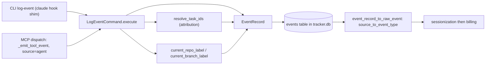

# Event Record & Payload Policy

A written policy for what a single row in the local `events` timeseries carries,
and — just as deliberately — what it does not. It reviews the record for
*traceability*: whether the attribution and provenance of an event can be
verified after the fact from the row alone.

This is a design review, not a change. Every claim below is grounded in the
shipped write path, which was consolidated into a single command by #507 / #509
(both merged before this review). The recommendations in
[Recommended policy](#recommended-policy) and the open items in
[Gaps and follow-up candidates](#gaps-and-follow-up-candidates) are advisory; the
ingest path implements them once, under their own issues.

## The record

An event is an `EventRecord` (`odoo_sdk/state/models.py`), appended to the single
`events` table in the central `tracker.db`. It is the persistence twin of the
pure `RawEvent` (`odoo_sdk/sessionization/models.py`) that the sessionization ETL
consumes.

| Field | Type | On the local write path | Purpose |
|-------|------|-------------------------|---------|
| `id` | `int?` | assigned by SQLite | row identity |
| `source` | `str` | `agent`, or `claude:<HookName>` from the shim | typing key for derivation |
| `timestamp` | `datetime` | current UTC when unset | the point event |
| `task_ids` | `list[str]` | resolved by `resolve_task_ids` | attribution scope |
| `repo` | `str` | resolved from the working tree (#509) | provenance |
| `branch` | `str` | resolved from the working tree (#509) | provenance |
| `pr_num` | `int` | always `0` (never inferred) | provenance |
| `subject` | `str` | the tool name for agent events | human-readable label |
| `payload` | `dict?` | `{"tool": name}` for agent events | extra fields |
| `external_id` | `str?` | always `None` for local writes | idempotency key |

All ten fields are written by one owner: `LogEventCommand.execute`
(`odoo_sdk/commands/log_event.py`). It is the single command-layer owner of the
`events` append (#407); both frontends construct it directly and hand over their
interface-specific inputs, so "commands own state mutation" holds for event
emission too. It is deliberately *not* a `@builtin_command` — the built-in
surface is a bijection with the MCP tool surface, and event emission must never
be an LLM-callable tool.

### Two frontends, one command

- **CLI `log-event`** (`odoo_sdk/cli/__main__.py`, `cmd_log_event`) persists the
  `claude:<hook>` shim events. Only interface-specific resolution stays in the
  subcommand: `--source` validation and `--payload` JSON parsing (`_parse_payload`).
  The `--task-id` hint and `--attach-active-run` flag pass straight through to the
  command, preserving the hook shim's documented contract.
- **MCP dispatch** (`odoo_sdk/mcp/server.py`, `_emit_tool_event`) records exactly
  one `source="agent"` row per *successful* tool call, with `subject=name` and
  `payload={"tool": name}`.

## Attribution & traceability

Traceability rests on four things the record can carry, three of which the
command now resolves on every write.

**Task scope (`task_ids`).** Decided once, by `resolve_task_ids`
(`odoo_sdk/commands/log_event.py`), which #507 lifted out of the two write sites
that used to disagree. The rule:

1. an explicit hint wins — `task_ids` is coerced by `normalize_task_ids`, which
   drops any non-task value (`None`, free text, a stray object) and canonicalizes
   the rest through `int`, so `5`, `"5"`, and `" 5 "` all record as `"5"`;
2. otherwise the event attributes to every *non-stale* active run
   (`_active_run_task_ids`, sharing `reap`'s staleness predicate), because any
   interaction with a task — read-only inspection included — is active work on it;
3. with no active run (or `attach_active_run=False`) the scope is empty:
   untargeted session-level activity, which is excluded from derivation
   permanently and can therefore never bill.

Before #507 the MCP wrapper attributed an event only when the dispatched tool's
signature literally contained a `task_id` parameter, so two tools doing
equivalent work on the same task landed on opposite sides of the derivation
filter. `_event_task_ids` (`odoo_sdk/mcp/server.py`) still derives that
signature-bound `task_id`, but now hands it over only as a *hint*.

**Provenance (`repo` / `branch`).** Resolved from the working tree at write time
(`current_repo_label`, `current_branch_label`) unless the caller states them
(#509). Both are best-effort display metadata: `_git_text` collapses every
failure mode — non-zero exit, no `git` on `PATH`, an OS-level spawn error — to
`""`, so a successful tool call is never turned into an error by provenance
lookup. `current_branch_label` asks `symbolic-ref --short HEAD` specifically so a
detached HEAD yields `""` rather than the literal string `HEAD`. This path used
to hardcode `repo=""`, which left every agent event unattributable to the code
that produced it and sessionized it under the repo-less sentinel.

**PR (`pr_num`).** Never inferred on this path — identifying the PR for a branch
costs a forge API round trip, which does not belong on a per-tool-call write. A
caller that knows the number states it; agent and hook events always write `0`.

**External identity (`external_id`).** Set only by the resync pullers
(`git:<sha>`, `gh:pr:<n>`, `gh:review:<id>`, `odoo:mail:<id>`) so a re-run dedupes
against the partial unique index on `events(external_id)`. Locally-emitted events
(agent / hook / FSM) leave it `None` and never dedupe — a design choice, with a
consequence noted under [Gaps](#gaps-and-follow-up-candidates).

**How the record is read back.** Derivation types an event by `source` alone.
`source_to_event_type` (`odoo_sdk/adapters/state_persistence.py`) maps the
canonical sources and resolves any `claude:<HookName>` to `EventType.CLAUDE_HOOK`;
an unknown source raises `UnknownEventSourceError` rather than silently
defaulting to a commit. The SQL derivation mirrors this with source *predicates*
(`odoo_sdk/state/db.py`): `_DEVELOPMENT_SOURCE_PREDICATE` (`commit`, `agent`,
`chatter`, `calendar`, `email`, `claude:%`) and `_REVIEW_SOURCE_PREDICATE`
(`review`, `comment`); `merge` is the sole ingested source excluded from windowed
billing. Note the traceability implication: `subject` and `payload` play **no**
part in typing, attribution, or billing — they are pure human-facing metadata.

## What is deliberately omitted

The payload-minimalism stance is stated in `_emit_tool_event`'s docstring
(`odoo_sdk/mcp/server.py`) and is correct as a default:

> The persisted record carries only the tool name (as both subject and payload)
> and the task scope derived from `task_id` — never any argument *values*.
> Chatter note bodies, stakeholder questions, search queries, and other free-text
> inputs are deliberately not written to the local events store, matching the
> `claude-event-hook` shim's stance of recording tool identifiers without
> prompt / `tool_input` contents.

Excluding argument *values* is a firm non-goal of any change here (see
[Non-goals](#non-goals)). The gap this review names is narrower: the policy was
defined as "record identifiers, not contents", but what agent events implement is
"record the identifier, *twice*". Between free text and nothing there is a middle
ground — argument *names*, the resolved scope, the attribution basis — that leaks
shape, not content, and was never considered.

## What the payload carries today

`payload` is not dead weight for every source — the omission is specific to agent
events:

- **Resync review/PR events** carry `pr_title` / `pr_body`, read back by
  `event_record_to_raw_event` and written by `raw_event_to_event_record`
  (`odoo_sdk/adapters/state_persistence.py`). This is genuine free text, admitted
  because it originates from an already-public forge artifact, not a local prompt.
- **Synthetic calendar ticks** carry a `synthetic` marker (`is_synthetic_tick`)
  so the gap-sweep can exclude them from its raw-event population without
  excluding them from session derivation.
- **CLI hook events** carry whatever `--payload` JSON object the shim supplies.
- **Agent events** carry `{"tool": name}` — and `subject` is that same `name`.
  The payload restates the subject and adds nothing. This is the case #510 asks
  us to decide.

## Recommended policy

Answering #510's three questions, grounded in what the record can already know
about itself:

1. **What must an event carry to be verifiable after the fact?** The scope it
   attributed to (`task_ids` — present) *and the basis for that attribution*. A
   reader cannot currently tell an explicitly-hinted event from an active-run
   fallback, because `resolve_task_ids` returns the ids but records nothing about
   which branch of its rule produced them. Recording the basis (an explicit hint
   vs. the active-run fallback) makes the #507 decision visible instead of
   inferred.
2. **Is there a safe subset for the payload?** Yes — the *resolved* `task_ids`
   are already a field; argument **names** (not values) are a safe addition. Names
   leak shape, not content, and let a reviewer see *why* an event attributed the
   way it did (e.g. a call that carried a `task_id` argument vs. one attributed by
   fallback). `pr_num`, `repo`, and `branch` are already first-class fields and
   belong there, not in the payload.
3. **Should `payload` duplicate `subject`?** No. If nothing informational
   replaces it, the `{"tool": name}` duplicate should be dropped and `payload`
   left `None` — `subject=name` already carries the tool identity, and `payload`
   is not consulted by derivation. If the argument-names subset from (2) is
   adopted, it replaces the duplicate rather than sitting beside it.

The recommended agent-event payload is therefore one of: `None` (drop the
duplicate), or `{"arg_names": [...], "attribution": "hint"|"active_run"}` (the
safe middle ground). Either is a strict improvement in traceability over
restating the subject. The choice is a single edit at `_emit_tool_event`'s call
into `LogEventCommand.execute`; no schema change is required, since `payload` is
already a free-form JSON object.

## Gaps and follow-up candidates

Listed, not fixed here. Each is a candidate for its own issue.

1. **Payload duplicates subject on agent events.** `_emit_tool_event` writes
   `payload={"tool": name}` with `subject=name`. Resolve per
   [Recommended policy](#recommended-policy) question 3. *(the core of #510.)*
2. **Attribution basis is not recorded.** `resolve_task_ids` returns the scope
   but not whether it came from an explicit hint or the active-run fallback, so
   the #507 decision is invisible in the row. A payload field would make it
   verifiable. *(pairs with #507.)*
3. **Argument names are not recorded.** The minimalism stance excludes argument
   *values*; it need not exclude their *names*, which reveal shape rather than
   content and would explain an attribution. *(pairs with #510 question 2.)*
4. **`pr_num` is never populated for locally-emitted events.** It is only ever
   set by a caller that already knows it; agent and hook writes always record `0`,
   so PR-level traceability is absent for the events this subsystem itself emits.
   #509 resolved `repo` / `branch` on this path but not `pr_num`. *(pairs with
   #509.)*
5. **No run linkage on the record.** An event carries `task_ids` but not the
   `task_runs` run id it was emitted under; the event-to-run association is
   reconstructed at derive time from timestamp + task id, never stored. A stable
   run reference would make per-run auditing exact rather than inferred.
6. **Local writes never dedupe.** `external_id` is `None` for every agent / hook /
   FSM write, so a double-emitted agent event is indistinguishable from two real
   ones. This is intentional today (only resync events dedupe), but it is a real
   traceability limit worth recording as an accepted gap.

## Non-goals

Do **not** start persisting argument *values* — chatter bodies, stakeholder
question text, search queries. The existing exclusion in `_emit_tool_event` is
correct and nothing in this policy relaxes it. Every recommendation above adds
identifiers, names, or scope — never free-text contents.
