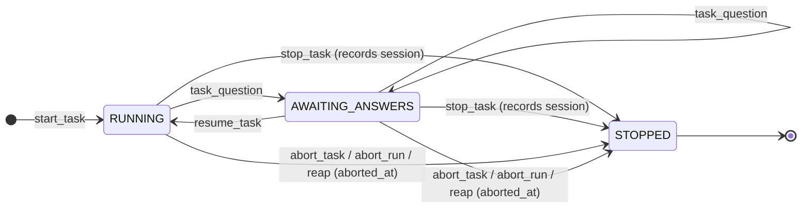

# Task Tracker FSM

State machine governing task time-tracking sessions. Each `project.task` record in Odoo
gets its own independent FSM instance (a `task_runs` row), keyed by task ID in a single
**central** SQLite database (`tracker.db`) shared across every project's container.
Multiple tasks can be active simultaneously (parallel worktree support).

## State Diagram

There is no distinct `ABORTED` state: an abort force-closes the active run to
`STOPPED` and additionally stamps the `task_runs.aborted_at` column, which
excludes the aborted run's leftover sessions from billing. A normal `stop_task`
leaves `aborted_at` unset so its window's derived sessions remain billable.

No FSM transition writes an `account.analytic.line` row. `start_task` creates
no Odoo timesheet (the former 0-hour `[/] Work in progress` anchor is gone as of
#325) and `stop_task` writes no hours — the FSM is pure local state plus a
best-effort chatter announcement. Every billable hour is derived from captured
events by the sessionization → ETL upload path, which is the **sole** owner of
timesheet writes; a run's `timesheet_id` therefore stays `NULL` until the upload
path materializes its derived session.

## States

| State              | Meaning                                                              |
|--------------------|----------------------------------------------------------------------|
| `RUNNING`          | Actively working — timer accumulating                               |
| `AWAITING_ANSWERS` | Questions posted to chatter; work blocked pending stakeholder input  |
| `STOPPED`          | Session ended; hours derived and billed later by the ETL upload path  |

Active states are `RUNNING` and `AWAITING_ANSWERS`. A task absent from the DB has no session.

## Transition Table

| From               | Event                     | To                 | Guard                                      |
|--------------------|---------------------------|--------------------|--------------------------------------------|
| (absent)           | `start_task`              | `RUNNING`          | No active session for this task_id; writes no timesheet |
| `RUNNING`          | `task_question`           | `AWAITING_ANSWERS` | Session exists in RUNNING state            |
| `AWAITING_ANSWERS` | `task_question`           | `AWAITING_ANSWERS` | Self-loop: additional questions allowed    |
| `AWAITING_ANSWERS` | `resume_task`             | `RUNNING`          | Session exists in AWAITING_ANSWERS state   |
| `RUNNING`          | `stop_task`               | `STOPPED`          | Session exists in RUNNING state; records session, writes no hours |
| `AWAITING_ANSWERS` | `stop_task`               | `STOPPED`          | Answers indicate no changes needed; records session, writes no hours |
| `RUNNING` / `AWAITING_ANSWERS` | `abort_task`  | `STOPPED`          | Active run exists; stamps `aborted_at`, logs no hours |
| `RUNNING` / `AWAITING_ANSWERS` | `abort_run`   | `STOPPED`          | Run resolved by SQLite run id or task id (reachable across checkouts); stamps `aborted_at` |
| `RUNNING` / `AWAITING_ANSWERS` | reaper        | `STOPPED`          | Run's last activity older than the staleness threshold; bulk-aborts via the same `abort_run` path |

## Guard Conditions

Guards are enforced by `LocalStateClient` in `odoo_sdk/state/db.py`; the typed
exceptions live in `odoo_sdk/state/models.py`:

- `TaskAlreadyRunningError` — `start_task` called when an active session exists
- `TaskNotRunningError` — operation requires an active session but none found
- `InvalidStateTransitionError` — transition not permitted from current state
- `TrackerStateMissingError` — the central DB is absent; it is host-provisioned and never self-created, so this single actionable error propagates rather than silently creating a fresh timeline

## Abort / Reap Lifecycle

Aborting is the escape hatch for wedged runs; it never logs hours.

- `abort_task(task_id)` (`odoo_sdk/commands/builtin/abort_task.py`) force-closes the *active* run for a task, delegating to `LocalStateClient.abort_run` (`odoo_sdk/state/db.py`), which moves the run to `STOPPED` and stamps `aborted_at`. It best-effort retires the run's orphaned Odoo `[/] Work in progress` anchor (renaming it to `[/] aborted stale run` at 0 h), never clobbering a human-edited anchor. Since #325 `start_task` creates no anchor, so a new run's `timesheet_id` is `NULL` and this close is a no-op; it still fires for **legacy** anchors left by a pre-#325 run.
- `abort_run(run_id_or_task_id)` (`odoo_sdk/commands/builtin/abort_run.py`) resolves a run by SQLite run id first, then by task id, so a run started from a since-deleted checkout is still reachable — there is now one central DB shared across every container. An already-stopped run is reported as a no-op.
- The reaper (`odoo_sdk/reap.py`) bulk-aborts every *stale* run through that same `abort_run` path (idempotent). A run's "last activity" is the most recent of the latest event attributed to its task id and its own `started_at`; a run is stale when that predates the threshold.
- `discover_runs` (`odoo_sdk/state/discovery.py`) is read-only: it lists active (`RUNNING` / `AWAITING_ANSWERS`) runs with a per-run `stale` flag so an operator can find and abort orphans. It needs no Odoo connection.
- Aborted runs are excluded from billing: the upload path skips any derived session lying wholly within an aborted run's `[started_at, aborted_at]` window (see `LocalStateClient.get_aborted_runs`).

## Notes

- State is persisted in the single central SQLite database `tracker.db` under the state root (`odoo_sdk/state/db.py`; `TRACKER_DB_FILENAME = "tracker.db"`). There is one host-provisioned, bind-mounted DB per user — `task_runs`, events, and the upload ledger all live in it — so the repo is an ordinary `owner/repo` column, not a per-repo directory hash.
- The state root is resolved by `_resolve_state_root` with precedence `ODOO_TASK_TRACKER_DIR` (highest) → XDG-aware default (`$XDG_STATE_HOME/odoo-task-tracker`). The DB is never self-created; its existence is the host's responsibility. (This replaces the retired per-repo `<project_dir>/tasks.db` + `sha256(git_remote_origin_url)[:16]` scheme; see `odoo_sdk/state/discovery.py` for the migration rationale.)
- Stopping from `AWAITING_ANSWERS` is valid — stakeholder answers may conclude no code changes are needed.
- The timer always uses the `started_at` timestamp in SQLite; elapsed hours are computed on-demand so they remain accurate even after long pauses.
